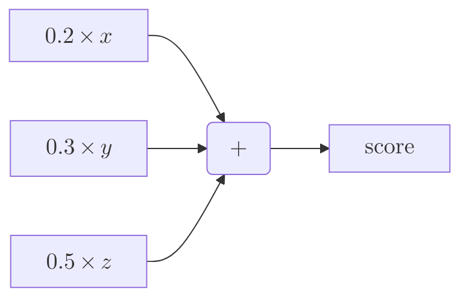
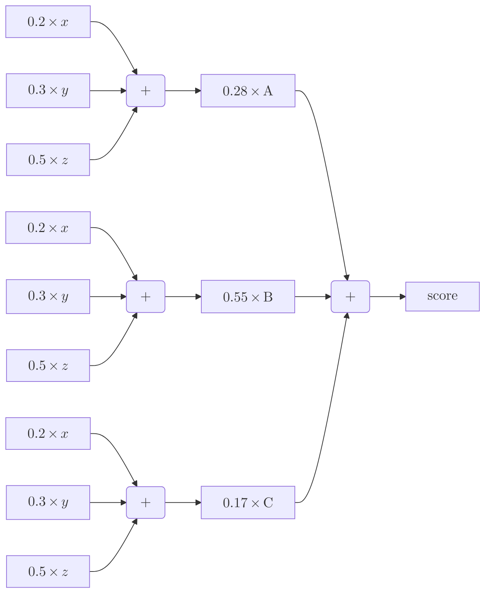

+++
date = "2025-05-06"
title = "The total derivative of a metric tree"
toc = true
tags = ['data-science']
+++

*A metric tree is a visual way to organize a complex metric. Count gives a good introduction [here](https://count.co/blog/intro-to-metric-trees). [Abhi Sivasailam](https://www.linkedin.com/in/abhi-sivasailam/) gave a popular [talk](https://www.youtube.com/watch?v=Dbr8jmtfZ7Q&ab_channel=DataCouncil) at Data Council 2023 if watching videos is your thing. [Ergest Xheblati](https://www.linkedin.com/in/ergestx/) is someone to follow if you want to go deeper. There's also a [recent article](https://www.lightdash.com/blogpost/metric-trees-how-top-data-teams-impact-growth) from Lightdash. Finally, there's [this article](https://timodechau.com/metric-trees-for-digital-analysts/) by Timo Dechau, but it's behind a paywall. The concept has a [homonym](https://en.wikipedia.org/wiki/Metric_tree), so beware when you browse for it.*

Many companies build metric trees without even knowing it. For instance, at Carbonfact, we have a health score to keep track of the state of each one of our customers. It's a weighted average of three inputs -- denoted $x$, $y$, and $z$ in the diagram below.

<div align="center" >



</div>

Our health score is just a linear combination of three metrics. We can think of it as a metric tree with one level of depth. We don't really care about that, though. We just compute it via a SQL query, which looks like this:

```sql
WITH
x AS (...),
y AS (...),
z AS (...)

SELECT (
    0.2 * x.value +
    0.3 * y.value +
    0.5 * z.value
) AS health_score
FROM x
JOIN y USING (account_id)
JOIN z USING (account_id)
```

So what's the point of using a metric tree? Visualization could a reason. But the metric is simple, so a table report is enough. The real reason is that the metric tree highlights the metric's structure. It shows how the metric is built, and how to break it down into its components.

Whenever you implement a metric at a company, you need to be able to explain it. Someone will eventually ask you [why the metric changed](/blog/kpi-evolution-decomposition/) over time. There isn't always a simple answer to that question. It would be convenient if there was though.

I like the idea that a metric tree is essentially just a function. You can think of it as a multivariate function that takes a set of inputs and returns a single output. There may be intermediate outputs, depending on the metric's complexity. The metric tree is just a way to visualize the function's structure.

Any well-defined function can be differentiated -- i.e. provided it is [continuously differentiable](https://en.wikipedia.org/wiki/Differentiable_function#:~:text=A%20function%20is%20said%20to%20be%20continuously%20differentiable%20if%20the,to%20have%20an%20essential%20discontinuity.). In particular, the [total derivative](https://en.wikipedia.org/wiki/Total_derivative) gives us a way to understand the change in the output with respect to each input. It is a linear approximation of the function at a given point.

$$
\frac{d f}{d t} = \sum_{i=1}^n \frac{\partial f}{\partial x_i} \frac{d x_i}{d t}
$$

You'd be right to find this a bit dumb, because it's Math 101. However, I haven't seen it used in the context of metric trees, or any kind of analytics engineering for that matter:

$$
f(x_{1}^{t+1}, \dots, x_{n}^{t+1}) - f(x_{1}^{t}, \dots, x_{n}^{t}) = \sum_{i=1}^n \frac{\partial f}{\partial x_i} \times (x_i^{t+1} - x_i^{t})
$$


I thought it would be interesting to try it out. I have some anonymized data from Carbonfact that I can use to illustrate the idea:

| account   | week       |   $x$ |   $y$ |   $z$ |    $w$ |
|:----------|:-----------|------:|------:|------:|-------:|
| A         | 2025-04-20 |   3 |   0 |   5 | 0.28 |
| A         | 2025-04-13 |   5 |   3 |   5 | 0.28 |
| B         | 2025-04-20 |   5 |   3 |   3 | 0.55 |
| B         | 2025-04-13 |   5 |   5 |   3 | 0.55 |
| C         | 2025-04-20 |   5 |   5 |   0 | 0.17 |
| C         | 2025-04-13 |   5 |   0 |   0 | 0.17 |

- There's three accounts: A, B, and C.
- Each account has two weeks of data: 2025-04-13 and 2025-04-20.
- Each week has three metrics: $x$, $y$, and $z$.
- There's also a $w$ column, which is weighting factor, but we'll leave it for later.

We can calculate the health score for each account and week. But the interesting part is being able to explain the change in the health score between two weeks, with respect to each input. We can do this by applying the total derivative method.

```py
import sympy as sp

# Define metric tree (just a simple linear combination here)
x, y, z = sp.symbols('x y z')
variables = [str(x), str(y), str(z)]
health_score_func = 0.2 * x + 0.3 * y + 0.5 * z

# Calculate gradient w.r.t. each input
gradient = {
    var: sp.diff(health_score_func, var) for var in variables
    for var in variables
}

for account in ['A', 'B', 'C']:
    # Calculate health score before and after
    T0 = scores.query('account == @account').iloc[1].to_dict()
    T1 = scores.query('account == @account').iloc[0].to_dict()
    observed_diff = (
        health_score_func.subs({var: T1[var] for var in variables})
        - health_score_func.subs({var: T0[var] for var in variables})
    )

    # Apply total derivative method
    diff_breakdown = {
        var: gradient[var] * (T1[var] - T0[var])
        for var in variables
    }
    total_diff = sum(diff_breakdown.values())

    # Print results
    print(f"{account=}")
    print("===========")
    print(f"{observed_diff:+.1f} : observed_diff")
    print(f"{total_diff:+.1f} : total_diff")
    print("~~~~~~~~~~~")
    for var, diff in diff_breakdown.items():
        print(f"{diff:+.1f} : diff({var})")
    print()
```

```diff
account='A'
===========
-1.3 : observed_diff
-1.3 : total_diff
~~~~~~~~~~~
-0.4 : diff(x)
-0.9 : diff(y)
=0.0 : diff(z)

account='B'
===========
-0.6 : observed_diff
-0.6 : total_diff
~~~~~~~~~~~
=0.0 : diff(x)
-0.6 : diff(y)
=0.0 : diff(z)

account='C'
===========
+1.5 : observed_diff
+1.5 : total_diff
~~~~~~~~~~~
=0.0 : diff(x)
+1.5 : diff(y)
=0.0 : diff(z)
```

It works!

- `observed_diff` corresponds to $f(x_{1}^{t+1}, \dots, x_{n}^{t+1}) - f(x_{1}^{t}, \dots, x_{n}^{t})$
- `diff(x)` corresponds to $\frac{\partial f}{\partial x}\times (x_1^{t+1} - x_1^{t})$
- `diff(y)` corresponds to $\frac{\partial f}{\partial x}\times (x_2^{t+1} - x_2^{t})$
- `diff(z)` corresponds to $\frac{\partial f}{\partial x}\times (x_3^{t+1} - x_3^{t})$
- `total_diff = diff(x) + diff(y) + diff(z)` corresponds to the sum of all the partial derivatives

The total derivative method provides a way to explain the change in the health score with respect to each input. We can see how much each input contributed to the change in the health score. We know it is valid because summing up the partial derivatives matches the observed difference between $t$ and $t+1$.

What I particularly like about this method is its universal applicability. It should work for any metric tree. For instance, let's say that we wish to calculate a weighted average of the customer health score, by weighting each account by its $w$ value. At Carbonfact $w$ corresponds to the customer's importance.



```py
import sympy as sp

# Define metric tree (just a simple linear combination here)
symbols = {
    account: {
        var: sp.symbols(f'{account}[{var}]')
        for var in ['x', 'y', 'z']
    }
    for account in ['A', 'B', 'C']
}
total_health_score_func = sum(
    0.2 * variables['x'] + 0.3 * variables['y'] + 0.5 * variables['z']
    for variables in symbols.values()
)

# Calculate gradient w.r.t. each input
gradient = {
    (str(account), var): sp.diff(total_health_score_func, variables[var])
    for account, variables in symbols.items()
    for var in variables
}

# Calculate health score before and after
def calculate_health_score(accounts: pd.DataFrame) -> float:
    return sum(
        account['w'] * health_score_func.subs({var: account[var] for var in variables})
        for account in accounts.to_dict(orient='records')
    )

T0 = scores.query('week == "2025-04-13"')
T1 = scores.query('week == "2025-04-20"')
observed_diff = calculate_health_score(T1) - calculate_health_score(T0)

# Apply total derivative method
diff_breakdown = {
    (account, var): (
        gradient[account, var] *
        (
            T1.query('account == @account')[var].iloc[0]
            - T0.query('account == @account')[var].iloc[0]
        )
    )
    for account, variables in symbols.items()
    for var in variables
}
total_diff = sum(diff_breakdown.values())

# Print results
print(f"{observed_diff:+.1f} — observed_diff")
print(f"{total_diff:+.1f} — total_diff")
print("~~~~~~~~~~~")
for (account, var), diff in diff_breakdown.items():
    print(f"{diff:+.1f} : diff({account}, {var})")
```

```diff
-0.4 : observed_diff
-0.4 : total_diff
~~~~~~~~~~~
-0.4 : diff(A, x)
-0.9 : diff(A, y)
=0.0 : diff(A, z)
=0.0 : diff(B, x)
-0.6 : diff(B, y)
=0.0 : diff(B, z)
=0.0 : diff(C, x)
+1.5 : diff(C, y)
=0.0 : diff(C, z)
```

The overall total health score is a function of 9 inputs: $x$, $y$, and $z$ for each account. The total derivative method still works. We can see how much each input within each account contributed to the change in the total health score.

The cool thing is that we can also differentiate with respect to each account. Indeed, it's useful to know the contribution of each account to the total health score, without necessarily drilling down to each input within each account.

```py
import sympy as sp

# Define metric tree (just a simple linear combination here)
symbols = {
    account: {
        var: sp.symbols(f'{account}[{var}]')
        for var in ['x', 'y', 'z']
    }
    for account in ['A', 'B', 'C']
}
account_health_scores = {}
for account, variables in symbols.items():
    account_symbol = sp.symbols(f'{account}')
    account_health_scores[account_symbol] = 0.2 * variables['x'] + 0.3 * variables['y'] + 0.5 * variables['z']
total_health_score_func = sum(account_health_scores.keys())

# Calculate gradient w.r.t. each account
gradient = {
    str(account): sp.diff(total_health_score_func, account)
    for account in account_health_scores
}

# Apply total derivative method
diff_breakdown = {
    account: (
        gradient[account] *
        (
            calculate_health_score(T1.query('account == @account'))
            - calculate_health_score(T0.query('account == @account'))
        )
    )
    for account in ['A', 'B', 'C']
}
total_diff = sum(diff_breakdown.values())

# Print results
for account, diff in diff_breakdown.items():
    print(f"{diff:+.1f} : diff({account})")
```

```diff
-1.3 : diff(A)
-0.6 : diff(B)
+1.5 : diff(C)
```

I find this very useful. To keep the metric tree metaphor alive, we can think of this as differentiating with respect to the branches, whilst the previous results were differentiating with respect to the leaves. The total derivative method is flexible enough to allow us to do that.

Anywa, how valid is this method? Well, the total derivative method is a well-established concept in calculus. It doesn't work so well for non-linear functions, when there are discontinuities or sharp jumps. But it works well for linear functions, which should cover a lot of the use cases for metric trees. That being said, it is supposed to be used to study infinitesimal local changes. Ultimately, the total derivative method is part of the larger family of [sensitivity analysis](https://en.wikipedia.org/wiki/Sensitivity_analysis). There may be other valid methods in that family, but I think the total derivative has nice properties that make it a good candidate for differentiating metric trees.

I have to apologize for the clunkiness of the code. I could have packaged this into something more elegant, but I wanted to keep the lid open on the implementation. I'm confident there's a nice way to package this into a friendly API.

My mind is buzzing with ideas of surfacing this up in a BI tool. I don't think [Metabase](https://www.metabase.com/), [Lightdash](https://www.lightdash.com/) or [Steep](https://steep.app/) fit the bill, because there's a need to call an [automatic differentiation](https://en.wikipedia.org/wiki/Automatic_differentiation) library. I used [SymPy](https://www.sympy.org/en/index.html) for the sake of example, but ideally a TypeScript library would be used to embed this in a tool like [Observable](https://observablehq.com) or [Evidence](https://evidence.dev). Another option would be to use [Pyodide](https://pyodide.org/en/stable/) to run Python in the browser. Also, how does this play with [DuckDB](https://duckdb.org/) if we want something quick and interactive? There's a lot to think about 🦆
